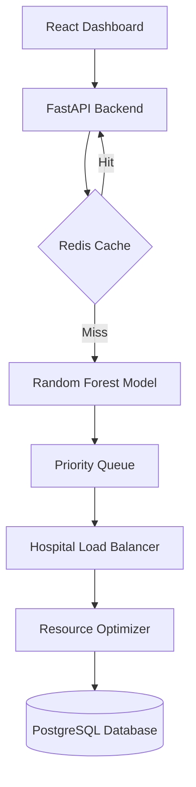

# 🚑 PredictEM – Emergency Medical Response System

**PredictEM** is an intelligent emergency response platform designed to assist healthcare professionals in managing critical situations with data-driven precision. The system integrates machine learning, optimization algorithms, and real-time routing to automate patient triage, hospital selection, and ambulance dispatch.

---

## 🌟 Key Features

* **🧠 AI-Powered Triage Prediction:** Uses a **Random Forest** model trained on 1,000+ simulated patient records to categorize urgency (Red/Yellow/Green).
* **⚡ High-Performance API:** Built with **FastAPI** utilizing an asynchronous architecture to handle high-throughput emergency requests.
* **🚀 Redis Caching:** Frequently requested triage predictions are cached to significantly reduce API latency.
* **📊 Resource Optimization:** Hospital resources (beds, doctors, ventilators) are allocated using **Linear Programming (PuLP)**.
* **🚦 Priority Queue System:** Implements a heap-based priority system:
    * 🔴 **Red:** Highest Priority (Critical)
    * 🟡 **Yellow:** Medium Priority (Urgent)
    * 🟢 **Green:** Lowest Priority (Stable)
* **🏥 Hospital Load Balancing:** Automatically selects facilities with the lowest load ratio to prevent system bottlenecks.
* **🚑 Smart Routing:** Employs **Dijkstra’s Shortest Path Algorithm** for the fastest ambulance dispatch.

---

## 🏗️ System Architecture



---

## 🛠️ Tech Stack

| Layer | Technologies |
| --- | --- |
| **Backend** | Python, FastAPI, SQLAlchemy, Redis, Docker |
| **Database** | PostgreSQL |
| **Machine Learning** | Scikit-learn (Random Forest) |
| **Optimization** | PuLP (Linear Programming) |
| **Algorithms** | Dijkstra’s Shortest Path, Priority Queue (Heap) |
| **Frontend** | React.js, Tailwind CSS |

---

## 📂 Project Structure

```text
PredictEm/
├── api/
│   └── main.py              # FastAPI Entry Point
├── modules/
│   ├── data_processing.py   # ML Data Preprocessing
│   ├── models.py            # ML Model Logic (Random Forest)
│   ├── database.py          # SQLAlchemy Configuration
│   ├── models_db.py         # Database Schema
│   ├── caching.py           # Redis Integration
│   ├── allocation.py        # Resource Optimization (PuLP)
│   ├── priority_queue.py    # Patient Prioritization
│   ├── load_balancer.py     # Hospital Load Balancing
│   └── routing.py           # Dijkstra’s Algorithm
├── data/
│   └── mock_patient_data.csv
├── predictem-dashboard/     # React Frontend
├── generate_data.py         # Mock Data Generator
├── create_tables.py         # DB Initialization Script
└── README.md

```

---

## ⚙️ Setup Instructions

### 1. Environment Setup

```bash
# Clone the repository
git clone [https://github.com/your-username/PredictEm.git](https://github.com/your-username/PredictEm.git)
cd PredictEm

# Create and activate virtual environment
python -m venv venv
source venv/bin/activate  # On Windows: venv\Scripts\activate

# Install dependencies
pip install -r requirements.txt

```

### 2. Infrastructure (Docker)

```bash
# Run Redis
docker run -d -p 6379:6379 --name predictem-redis redis

# Run PostgreSQL
docker run -d -p 5432:5432 --name predictem-postgres \
  -e POSTGRES_USER=postgres \
  -e POSTGRES_PASSWORD=admin \
  -e POSTGRES_DB=predictem \
  postgres

```

### 3. Application Start

```bash
# Initialize Database
python create_tables.py

# Start Backend
uvicorn api.main:app --reload --port 8001

# Start Frontend
cd PredictEm-dashboard
npm install
npm start

```

---

## 🔗 API Endpoints (Quick Reference)

| Method | Endpoint | Description |
| --- | --- | --- |
| `POST` | `/triage` | Predicts triage category from vital signs. |
| `POST` | `/allocate-resources` | Optimizes bed/staff distribution. |
| `GET` | `/dispatch-ambulance` | Finds the nearest hospital using Dijkstra. |

**Example Triage Request:**

```json
{
  "heart_rate": 120,
  "blood_pressure": 80,
  "oxygen_level": 95,
  "injury_severity": 3
}

```

---

## 🔮 Future Enhancements

* 🗺️ **Live Emergency Map:** Integrate Leaflet/Mapbox for real-time ambulance tracking.
* 🔔 **Automated Notifications:** WebSockets/Twilio alerts for hospital staff.
* ☁️ **Cloud Scalability:** Deployment via Kubernetes and AWS/GCP.
* 📊 **Advanced Analytics:** Real-time dashboard for regional emergency trends.

---

## 👩‍💻 Author

**Prachi Sah** *Software Engineer*
